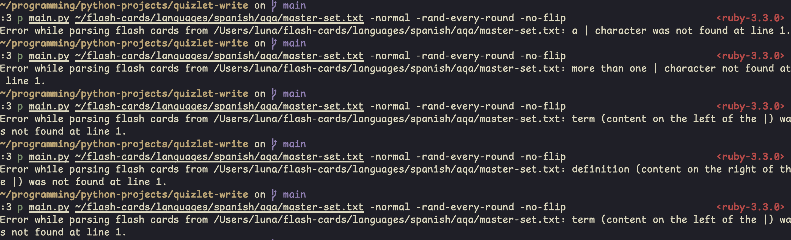

Contents

<!-- vim-markdown-toc GFM -->

* [Build log](#build-log)
    * [2025-07-09 (21:30) - 2025-07-10 (01:20)](#2025-07-09-2130---2025-07-10-0120)
    * [2025-07-04](#2025-07-04)
    * [2025-04-18 (19:26)](#2025-04-18-1926)
    * [2024-12-29 (1:00)](#2024-12-29-100)
    * [2024-12-29](#2024-12-29)
    * [2024-12-28 (21:28)](#2024-12-28-2128)
    * [2024-12-28 (17:18)](#2024-12-28-1718)
    * [2024-11-25 (13:23)](#2024-11-25-1323)
    * [2024-11-23](#2024-11-23)
    * [2024-11-04 (23:16)](#2024-11-04-2316)
    * [2024-11-04 (22:45)](#2024-11-04-2245)
    * [2024-11-02 (21:32)](#2024-11-02-2132)
    * [2024-11-02 (20:40)](#2024-11-02-2040)
    * [2024-11-01](#2024-11-01)
    * [2024-11-01 (10:02)](#2024-11-01-1002)
    * [2024-10-31 (15:31)](#2024-10-31-1531)
    * [2024-10-10 (21:45)](#2024-10-10-2145)
    * [2024-10-06 (02:21)](#2024-10-06-0221)
    * [2024-09-07 (01:20)](#2024-09-07-0120)
    * [2024-08-31 (01:11)](#2024-08-31-0111)
        * [2024-09-01 (00:29) amendment:](#2024-09-01-0029-amendment)
    * [2024-08-30 (01:19)](#2024-08-30-0119)
    * [2024-08-29 (01:00)](#2024-08-29-0100)
    * [2024-08-26 (02:00)](#2024-08-26-0200)
    * [2024-08-25](#2024-08-25)
    * [2024-08-24 (22:02)](#2024-08-24-2202)
    * [2024-08-24 01:53 (AM)](#2024-08-24-0153-am)
    * [2024-07-18](#2024-07-18)
        * [2024-08-15 additional explanation for above bugfix:](#2024-08-15-additional-explanation-for-above-bugfix)
    * [2024-05-15 14:33](#2024-05-15-1433)
        * [2024-08-15 amendment:](#2024-08-15-amendment)
    * [2024-05-15](#2024-05-15)
    * [2024-03-08](#2024-03-08)
    * [2024-03-07](#2024-03-07)
    * [2024-02-22](#2024-02-22)
    * [2024-02-21](#2024-02-21)
    * [2024-02-20](#2024-02-20)
* [Known issues](#known-issues)
* [Lesson of the day](#lesson-of-the-day)

<!-- vim-markdown-toc -->

# Build log

## 2025-07-09 (21:30) - 2025-07-10 (01:20)

- refactored argparse code so that args all play nice with each other
    - e.g `--test` can be used anywhere in between, before, or after the positional arguments in the command line relating to the primary function of the program as a flash card test
    - the other optional commands function as intended at the same time as the above point is implemented
- changed all instances of the word "randomise" to "randomize"

## 2025-07-04

- restructured the stats collection in \`main.py\` to point all json handling to one file (\`lifetime_stats.json\`) instead of separate files

## 2025-04-18 (19:26)

- tidied up descriptions of command line arguments, progressed on flip_flash_card_file() and caught error case in render_cards() to give a helpful error if the flash card file exists, but is empty

## 2024-12-29 (1:00)

- changed the command line argument detection a bit, started on the `-help` command, added features to create bar charts of the number of sessions/flash cards done on each day

## 2024-12-29

- moved hint system, colors, help, constants, and commands to a separate `my_modules/` folder

## 2024-12-28 (21:28)

- made it so the y axis is copied to the right side of the graph and the x axis is copied to the top of the graph, y axis now increments in 1s instead of 5s

## 2024-12-28 (17:18)

- fixed bug on `hard` and `normal` modes where after text in brackets, all text after the brackets would also be shown. The solution was to put `inside_brackets = False` before `hint += msg[i]` in the `elif` statement checking for the closing bracket. I think `inside_brackets = False` turned out to be an unreachable line of code. this issue still persists on `easy` mode though

## 2024-11-25 (13:23)

- added more print statements for when the libraries are importing it reassures the user that something is going on rather than the program crashing

## 2024-11-23

- made it so the check for the number of command line arguments is done before matplotlib is imported to save time if the user doesn't supply the correct number of arguments, they don't ahve to wait for `matplotlib.pyplot` to fully import before the check happens

## 2024-11-04 (23:16)

- made it so that the program detects if a character is Latin, or Japanese or Chinese when the hint is being made. this lets the program enter a Japanese/Chinese monospaced underscore '＿' instead of a Latin underscore '_', which makes the app more readable during the quiz

## 2024-11-04 (22:45)

- added support for Japanese monospaced brackets （ ）

## 2024-11-02 (21:32)

- made 2 txt files each for the data used to plot the x and y axis, saved under that session's particular dir

## 2024-11-02 (20:40)

- added the path to flash cards on the graph title

## 2024-11-01

- implemented feature that plots all rounds' consistencies on a single graph, complete with a key and different colours for each line

## 2024-11-01 (10:02)

- made it so the graph's width scales to accommodate the number of xticks ther are. if not, then they overlap and the x axis becomes unreadable though still technically functional

## 2024-10-31 (15:31)

- re-imagined line graph feature to plot % accuracy vs num. of questions answered instead of % accuracy vs % progress

## 2024-10-10 (21:45)

- added code to `render_cards()`. explicitly does nothing if line of the flash card file is empty with `line.strip()`, as the line will be removed if it's empty
- added a feature to the program in `render_cards()` that tells the user when an error is detected parsing the flash card file where the format of `term|defnition` isn't followed
- also gonna start screenshotting my tests
- order of tests:
    1. pipe character `|` presence check - the `|` on the line has been removed on that line
    1. pipe character `|` presence check - more `|` characters have been added on that line
    1. content presence check - right side of the `|` has been removed on that line
    1. content presence check - left side of the `|` has been removed on that line
    1. content presence check - the content on both sides of the `|` has been removed, only the `|` remains on that line

## 2024-10-06 (02:21)

- added a stats tracker for the number of sessions finished in that day, not just the already established terms studied per day
    - can now calculate the average length of a flash card set on a given day knowing the number of terms studied

## 2024-09-07 (01:20)

implemented a feature where the command line arguments that are passed into the quiz are also written to the record file

## 2024-08-31 (01:11)

- implemented a feature that allows the user to have more than one session open at a time using a temporary results file - documentation in `main.py`
- fixed a bug with the above feature where the temporary results file (called `this_sessions_results_file` in `main.py`) where the temp results file wouldn't get deleted if the user pressed ctrl + c
    - fixed by putting parts of the code the user interacted with in a try-except block. it catches the KeyboardInterrupt and deletes the temp results file.
- fixed a bug where only one of multiple concurrent sessions add to the count of the terms done today.
    - solved by moving the code that handles incrementing the count of the terms done today downwards to exactly when it's needed.
    - it used to be high up in the code which meant that the count would be calculated way before the user started answering questions.
    - **both concurrent sessions would have the same number of completed terms to start with.**
        - one session finishes and increments # terms.
        - the other session finishes, but still has the original term count, so the count doesn't increase/increases to the wrong amount because it adds to the previous amount

### 2024-09-01 (00:29) amendment:

- "solved by moving the code that handles..." this has meant that when you end a session on a day after you start it, you no longer increase the term count for the day you started the session on.

## 2024-08-30 (01:19)

- added `set_highest_streak()`, `set_current_streak()`, and `decrement_streak()` methods to the `QuizCounter` class
- makes the class more expandable in the future

## 2024-08-29 (01:00)

- added feature where you can see the file name of where the cards are from during the session
- changed all the command line arguments to lead with a single `-` instead of 2 `-`s
- refactored code so that the difficulties are stored in a constant list as they won't change, i put it in global scope because it's used by both `quiz()` for deciding what hint to make and `main()` for handling the command line input of the difficulty

## 2024-08-26 (02:00)

- added feature to `main.py` where the record file now consists of the start date and time of the session and its end date and time
- idk when previous records were started so they'll all have the default start time of `0000-00-00 00:00:00.000000`

## 2024-08-25

- fixed a bug where the program would tell you that you've done a negative number of terms after the first session of the day

## 2024-08-24 (22:02)

- made it so `terms-per-day.json` is now in a human-readable format
- previous solution in code converted between json and strings too much (inefficient usage of `json.dumps()` and `json.loads()` where `json.dump()` and `json.load()` was better)
- new solution makes more efficient use of json so it can be written back to `terms-per-day.json` in a human-readable format (with `json.dump(obj_to_be_written, f, indent=4`)

## 2024-08-24 01:53 (AM)

- added an extra line to the record file saying the number of terms in the card set for the session. allows any people and future programs to see the theoretical max streak
- updated the code to save each record file as a `.txt` instead of extensionless. more clarity on the purpose of the record files.
- added functionality to the random feature that allows the user to use the old random functionality (now renamed to `--rand-once`, or just not randomise at all), or use the new functionality of randomising the cards every time the round ends (called `--rand-every-round`).
- somehow fixed a bug that cropped up where i would complete the cards at `test/testfile.txt` 3 correct 1 wrong, then get the last one right but it would still count as a perfect streak of 4. Hopefully that's fixed now I really hope no more bugs come up about the streak functionality.

## 2024-07-18

- fixed a bug in the terms per day functionality in `stats/terms-per-day.json` where the terms weren't being updated in the json object correctly
- fixed by adding another constant called NUM_TERMS but in the correct scope, and switching from `readlines()` to `readline()`. `readlines()` returns a list of strings where each string is a line in the file, but `json.dumps()` cannot take a list input

### 2024-08-15 additional explanation for above bugfix:

the fix i made so that the date shows up correctly in `terms-per-day.json`:
the date is figured out at the top of the quiz procedure, so the terms done in that day is
either already there and can be incremented by the number of terms in the card set,
or the date is created in the file and assigned the NUM_TERMS.

`write_terms_per_day()` is called at the very end of the quiz after the whole card set has been
studied. this ensures that the flash cards studied on that day are only written to the file if
the user has actually completed that flash card set.

there was a problem with the date not being added because the date would get messed up if you complete a session in a day after you started the session
but since the date is determined at the time the quiz starts, the quiz can be left over several days into the future and
at the end of the quiz, the file is written to with the date when `quiz()` is called.

i'm essentially storing correct data in advance and then only committing to changing a file
when i'm absolutely ready

## 2024-05-15 14:33

- having trouble with the streak functionality and scope. idk how to actually do it

### 2024-08-15 amendment:

- this feature has since been implemented and is functional

## 2024-05-15

- added percentage correct next to correct counter (in brackets)
- added percentage progress

## 2024-03-08

- i think i'm finally finished with it (the code)
- started development on the technical explanation
- need to comment the whole code before starting on code lower than the `Color` class

## 2024-03-07

- i have new hint algorithms

## 2024-02-22

- implemented command line arguments

## 2024-02-21

- starting development of more command line arguments (--randomise)

## 2024-02-20

- completed development of first revision
- if there are vocab files that are empty, that is known (2024-03-08 update: vocab is at <https://github.com/RubberDuckCollector/https://github.com/RubberDuckCollector/flash-card-collection>)

# Known issues

1. text after Japanese brackets `（）` isn't making it to the hint, doesn't even register when user is prompted to answer as all the text before and including the brackets is present and required to answer correctly

# Lesson of the day

- if you want to combine function arguments with string parsing, don't rely on chatgpt at all
- 2024-03-07 update: i lied
