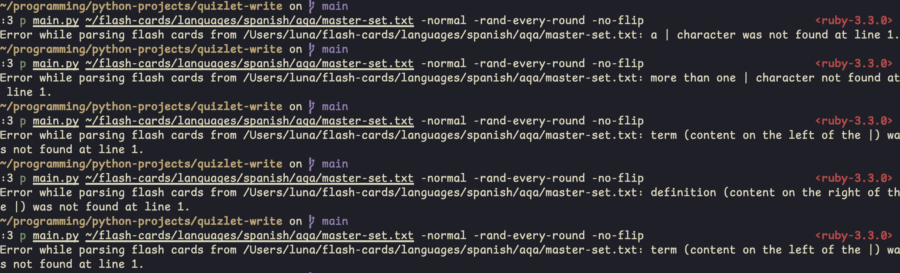

# Table of contents

<!-- vim-markdown-toc GFM -->

* [Quizlet write my version](#quizlet-write-my-version)
* [Features](#features)
* [Why I made this](#why-i-made-this)
* [Disclaimer](#disclaimer)
* [Prerequisites](#prerequisites)
    * [input for the program:](#input-for-the-program)
* [Optional](#optional)
* [Overview](#overview)
* [Demo video (old)](#demo-video-old)
* [Technical Explanation (WIP)](#technical-explanation-wip)
* [Notes](#notes)
* [Next features](#next-features)
* [Build log](#build-log)
    * [2024-02-20](#2024-02-20)
    * [2024-02-21](#2024-02-21)
    * [2024-02-22](#2024-02-22)
    * [2024-03-07](#2024-03-07)
    * [2024-03-08](#2024-03-08)
    * [2024-05-15](#2024-05-15)
    * [2024-05-15 14:33](#2024-05-15-1433)
        * [2024-08-15 amendment:](#2024-08-15-amendment)
    * [2024-07-18](#2024-07-18)
        * [2024-08-15 additional explanation for above bugfix:](#2024-08-15-additional-explanation-for-above-bugfix)
    * [2024-08-24 01:53 (AM)](#2024-08-24-0153-am)
    * [2024-08-24 (22:02)](#2024-08-24-2202)
    * [2024-08-25](#2024-08-25)
    * [2024-08-26 (02:00)](#2024-08-26-0200)
    * [2024-08-29 (01:00)](#2024-08-29-0100)
    * [2024-08-30 (01:19)](#2024-08-30-0119)
    * [2024-08-31 (01:11)](#2024-08-31-0111)
        * [2024-09-01 (00:29) amendment:](#2024-09-01-0029-amendment)
    * [2024-09-07 (01:20)](#2024-09-07-0120)
    * [2024-10-06 (02:21)](#2024-10-06-0221)
    * [2024-10-10 (21:45)](#2024-10-10-2145)
    * [2024-10-31 (15:31)](#2024-10-31-1531)
    * [2024-11-01 (10:02)](#2024-11-01-1002)
    * [2024-11-01](#2024-11-01)
    * [2024-11-02 (20:40)](#2024-11-02-2040)
    * [2024-11-02 (21:32)](#2024-11-02-2132)
* [Lesson of the day](#lesson-of-the-day)

<!-- vim-markdown-toc -->

# Quizlet write my version

- Find the flash cards that work with this program here: https://github.com/RubberDuckCollector/my-flash-cards
- note: i recommend using this for german vocab where the plural conjugation can be in brackets. the program will preserve contents in the brackets so you don't have to memorise what's in the brackets.
- e.g: the recipe - das Rezept *(-e)*

# Features

- Overall, the same as Quizlet Write (type the answer on the flash card)
- Can have multiple sessions going at the same time (they're all tracked independently)
- Can generate cool graphs of how you did on each round of the quiz

# Why I made this

- I was getting annoyed at how I had to navigate the quizlet flash cards with tab and shift+tab, so I made a replica of their flash card system to give me more control over the vocab learning process. I can use my own editor (Vim) to write the flash cards instead of quizlet's one and use Vim remaps to insert text really fast into the flash cards
- No waiting for web page loads, just the program loading
- I have my own system for the format of flash cards now, so I can change the source code to my needs. E.g: I've incorportated a streak function and progress percentages -> more control, software can be tailored to my needs instead of living with an imperfect offering from a company serving the software to me
- This solution to flash cards is also ad-free.
- Because this program is open source, the user can clone this repo and edit their version of the source code to suit their specific needs, another benefit over Quizlet
- analysis of study patterns - `stats/terms-per-day.json` holds the number of flash cards studied on each day. JSON is easily machine-readable. Benefits:
    - [x] I can import the file to a progam and create a graph of my study
        - [x] Data mining opportunities
    Current drawbacks:
        - cannot filter activity by language.

# Disclaimer

- **"terms" and "flash cards" are interchangable. "term" refers to both the question and answer on each side of the flash card.**
- A "session" is one completion of all the flash cards from a file. A completed session means you've answered all the cards correctly at least once.
- If you wait until tomorrow to finish a session, you'll get credit for the day you finish the session on. e.g starting a session on the 1st of Jan. but finishing it on the 2nd will increase the terms done count for the 2nd of Jan., when the session is completed.
- Results.txt may have random vocab answers in it, i guess it can be a demonstration of what goes on during program execution and the file when you abort the program with Ctrl + C (contents of the file haven't been cleared yet) but it's mainly from my testing of the program.
- I also know how cursed this file is if you open it raw. Try not to think about it.
- if you don't want the `records/` dir to have my records in it when you download the repo, just delete the files

# Prerequisites

- a Python version past 3.10 (this was built on python 3.12)
- matplotlib (working on a no-matplotlib version)

## input for the program:
- a text file in the format `content|more-content`, on each line of the file like this:
```
hello|hola
goodbye|adiós
how are you?|¿qué tal?
```
for the whole length of the file, save for lines starting with a `#`. They'll be ignored by the program as code comments/handled separately.

# Optional

- matplotlib (WIP) (will be made optional through an extra command line argument in the future)

# Overview

<details><summary>Overview:</summary>
    <ol type="1">
        <li>The user runs the program (e.g <code>python3 main.py ~/subject-resources/cards/languages/spanish/as/unit2.txt --normal --rand --noflip</code>). I have my flash cards at <code>~/subject-resources</code>.</li>
        <li>The program parses the flash cards. The format of the flash cards should be: <code>term|definition</code>. The cards are allowed to have () brackets, but each set of brackets has to be separate from each other embedded brackets shouldn't happen. For example, this is the only allowed formation: <code>term|definition (data1) (data2)</code></li>
        <li>The program asks the user the questions. The key is the question and the value is the answer.</li>
        <li>If the user gets the question right, the program will add that key and value pair to a new dictionary called <code>correct_answers</code>. The program also writes a line to <code>results.txt</code> with a tick on the left, the prompt on the left, and the answer on the right.</li>
        <li>If the user gets the question wrong, the program will tell the user. The program asks the user to confirm the answer, and if they don't, the program will write a line to <code>results.txt</code>, where there's a cross on the left, then the promt, then the answer.</li>
        <li>If the user inputs an empty string/answer made up of only spaces, the program will make them copy out the answer until they get it right. It then considers this as incorrect.</li>
    </ol>
</details>

# Demo video (old)

<https://youtu.be/rUKUTK_Q52E>

# Technical Explanation (WIP)

<details><summary>Technical Explanation:</summary>
    <ul> <!-- DON'T USE LIST ELEMENTS ON THIS LIST, THIS LIST IS HERE TO CREATE INDENTATION -->
        <details><summary><b>Files:</b></summary>
            <ul>
                <li>
                    <p><u>File structure:</u></p>
                    <pre>
                        <code>
.
├── LICENSE
├── README.md
├── __pycache__
│   └── constants.cpython-312.pyc
├── constants.py
├── main.py
├── results.txt
└── tests
    ├── graveyard.py
    ├── test.py
    ├── test2.py
    ├── test3.py
    └── test4.py
                        </code>
                    </pre>
                </li>
                <li><a href="https://github.com/RubberDuckCollector/quizlet-write/blob/main/constants.py"><code>constants.py</code></a>: contains the <code>chars_to_ignore</code> list. It's in the file because It can be imported to all my test files. It lets me manage a global variable across many scripts, making it easy to test code in different files with a known piece of data. Being requireable in a separate file makes it easier to debug too. I want all my tests and <code>main.py</code> to be on the same page and working with the same constants.</li>
                <li><code>main.py</code>: stores all of the logic of the program. Run this file to use it</li>
                <li><code>README.md</code>: this file.</li>
                <li><code>constants.py</code>: contains <code>chars_to_ignore</code> and is imported by my python scripts</li>
                <li><code>LICENSE</code>: license</li>
                <li><code>tests/</code>: contains files I've used to test python code that I've later added to <code>main.py</code>. I used these test files becauase I don't want to test within <code>main.py</code> to prevent something bad from happening. Feel free to poke around and read the shitty code</li>
            </ul>
        </details>
        <details><summary><strong>The code:</strong></summary> <!-- THE CODE -->
            <ul>
                <li>I'll try to cover this line by line going downwards through the file</li>
                <li>But this may not be possible because it's really hard</li>
                <li>There may not be links to line numbers, and instead there'll be a reference of what is written <code>like this</code> because keeping this file up to date with line numbers that can change is a very daunting task. This is also only my second documentation project (apart from the ocr-programming-challenges) and it's also daunting because of that. I want to keep it at least somewhat easy for myself.</li>
            </ul>
            <ul> <!-- DON'T USE LIST ELEMENTS ON THIS LIST, THIS LIST IS HERE TO CREATE INDENTATION -->
                <details><summary><u>Imports:</u></summary> <!-- IMPORTS -->
                    <ol type="1">
                        <li><code class="language-python">os</code> in <a href="https://github.com/RubberDuckCollector/quizlet-write/blob/main/main.py#L1"><code>main.py</code></a>: used to detect the operating system the user is running the revision on, clears the terminal to make sure each question appears starting from the same place. https://docs.python.org/3/library/os.html</li>
                        <li><code>sys</code> in <a href="https://github.com/RubberDuckCollector/quizlet-write/blob/main/main.py#L2"><code>main.py</code></a>: used in conjunction with <code>os</code> to clear the terminal, also manages the command line arguments. https://docs.python.org/3/library/sys.html</li>
                        <li><code>time</code> in <a href="https://github.com/RubberDuckCollector/quizlet-write/blob/main/main.py#L3"><code>main.py</code></a>: used to pause the program to let the user read what's on the screen. The text is also in different colours which makes it a bit easier to read because it stands out. https://docs.python.org/3/library/time.html</li>
                        <li><code>random</code> in <a href="https://github.com/RubberDuckCollector/quizlet-write/blob/main/main.py#L4"><code>main.py</code></a>: I used <code>random.shuffle</code> to jumble up the key and value pairs in the <code>cards</code> dict, they will be in a pseudo-random order when they're looped through if user specifies <code>--rand</code> in the command line arguments. https://docs.python.org/3/library/random.html</li>
                        <li><code>readline</code> in <a href="https://github.com/RubberDuckCollector/quizlet-write/blob/main/main.py#L5"><code>main.py</code></a>: this library attaches onto the builtin python <code>input</code> procedure, it adds support for UP arrow bringing back your last input, pasting from clipboard, arrow keys etc. It's really helpful if you mistype something and only have to change 1 letter, press UP and your previous answer will come back. https://stackoverflow.com/questions/45772230/arrow-keys-not-working-while-entering-data-for-input-function</li>
                        <li><code>platform</code> in <a href="https://github.com/RubberDuckCollector/quizlet-write/blob/main/main.py#L6"><code>main.py</code></a>: need this to add Windows support. See <a href="https://github.com/RubberDuckCollector/quizlet-write/blob/main/main.py#L40"><code>here</code></a> for its usage. https://docs.python.org/3/library/platform.html https://www.geeksforgeeks.org/platform-module-in-python/</li>
                        <li><code>from constants import chars_to_ignore</code> in <a href="https://github.com/RubberDuckCollector/quizlet-write/blob/main/main.py#L7"><code>main.py</code></a>: I'm importing/requiring <code>chars_to_ignore</code> from <code>constants.py</code> (the <code>.py</code> extension is not needed here). The <code>chars_to_ignore</code> list is now able to be used throughout <code>main.py</code>. https://www.educative.io/answers/how-to-import-custom-module-in-python</li>
                    </ol>
                </details>
                <details><summary><u>Other data:</u></summary>
                    <ul>
                        <li>Class <code>Color</code> in <a href="https://github.com/RubberDuckCollector/quizlet-write/blob/main/main.py#L13"><code>main.py</code></a>: This defines the colours that the terminal can use. Python can print to the terminal using these colours. This is useful to me because showing important elements of the program's output to the user in different colours increases the program's usability. This isn't an import because it doesn't need to be. I'm only using this in one file.</li>
                    </ul>
                </details>
            </ul>
        </details>
    </ul>
</details>

# Notes

none

# Next features

- [x] streak feature (100% = perfect streak)
- [x] records system where the program dumps the contents of `results.txt` into a new file with the current date and time accurate to the second into a records dir
- [x] statistics and tracking - daily word count of terms done
- [x] expand --rand functionality to randomise at the end of each round, instead of only at the start of the session
- [x] tell the user the previous terms done today and the new terms done today
- [x] 2024-08-31: implement a feature that allows the user to have more than one session open at a time 
    - 11-10-2024: (this is done by having separate files tracking the progress of each session, no two files would conceivably be of the same session because the name is decided by time up to 6 digits on the second)
- [x] implement a feature that tracks every session's % correct and generates a line graph of the session
- [x] implement a feature where the command line arguments that are passed into the quiz are also written to the record file
- [x] add a stats tracker for the number of sessions finished in that day, not just the already established terms studied per day
- [x] implement a feature where the program ignores lines starting with a # in the flash card file. this allows me to put metadata in the flash card file and print it out when the session starts.
- [x] remove the 0/0 on the graph (2024-11-01)
- [x] might not be recording accuracy at 100% completion of the round PLEASE FIX (2024-11-01)
- [x] implement a feature where each round on the line graph has a different coloured line (2024-11-01)
- [x] write the path to flash cards on the graph title
- [x] make 2 txt files each for the data used to plot the x and y axis, saved under that session's particular dir
- [ ] a new command line argument where i use regex to highlight numbers in a special colour
- [ ] implement a feature where at the end of a session, ask the user if they want to save the terms they got incorrect on the first round to a new file
    - file called `"{filename} {session_end_date_and_time} incorrect.txt"`
    - REQUIREMENTS: would need to make every session inside `stats/records` its own directory containing the record file and the graph
    - accuracy on the y axis, words done on the x axis
    - could do x axis as "terms remaining" and count down, or as "terms completed" and count up
    - could also do x axis as "% terms completed" or "% terms remaining"
    - this would be a measure of consistency
- [ ] implement a feature where the time taken to complete the quiz is written to the record file
- [ ] implement a feature where the command line arguments accept multiple files like this: `/file /file /file -difficulty -rand -flip`
    - files are appended to each other for the test (hold file paths in a list?)
- [ ] implement a feature that creates a bar chart with terms done on each day (Y axis) and date (X axis). days with 0 terms do not take up a space on the bar chart (maybe add an option to show all days regardless?)
    - can now calculate the average length of a flash card set on a given day knowing the total number of terms studied and the total number sessions studied
    - implement it as a command line argument taken at the first position
- [ ] implement a `-help` command line argument
    - maybe make the program run a bash script, integrating the `less` command or something idk
- [ ] make matplotlib optional through only importing it if an if statement has been checked, also if statements whenever it's used elsewhere
    - can only be done with modular code with very few lines outside of global scope, as matplotlib will hopefully be imported in `main()`
- [ ] add a fast mode where time.sleep() doesn't activate and the last term the user answered is displayed at the top of the screen as correct/incorrect
- [ ] add feature that puts the start and end date/times in the results file
- [ ] add signals that tell the user the program is loading/importing libraries/when the program is first run and there's a big loading time, this would let the user that nothing's going wrong
    - maybe with a ... that increments
    - or integrate a logging system (with proper standardised logging library)

# Build log

## 2024-02-20

- completed development of first revision
- if there are vocab files that are empty, that is known (2023-03-08 update: vocab is at <https://github.com/RubberDuckCollector/my-flash-cards>)
## 2024-02-21

- starting development of more command line arguments (--randomise)

## 2024-02-22

- implemented command line arguments

## 2024-03-07

- i have new hint algorithms

## 2024-03-08

- i think i'm finally finished with it (the code)
- started development on the technical explanation
- need to comment the whole code before starting on code lower than the `Color` class

## 2024-05-15

- added percentage correct next to correct counter (in brackets)
- added percentage progress

## 2024-05-15 14:33

- having trouble with the streak functionality and scope. idk how to actually do it
### 2024-08-15 amendment:
- this feature has since been implemented and is functional

## 2024-07-18

- fixed a bug in the terms per day functionality in `stats/terms-per-day.json` where the terms weren't being updated in the json object correctly
- fixed by adding another constant called NUM_TERMS but in the correct scope, and switching from `readlines()` to `readline()`. `readlines()` returns a list of strings where each string is a line in the file, but `json.dumps()` cannot take a list input

### 2024-08-15 additional explanation for above bugfix:
the fix i made so that the date shows up correctly in `terms-per-day.json`:
the date is figured out at the top of the quiz procedure, so the terms done in that day is
either already there and can be incremented by the number of terms in the card set,
or the date is created in the file and assigned the NUM_TERMS.

`write_terms_per_day()` is called at the very end of the quiz after the whole card set has been
studied. this ensures that the flash cards studied on that day are only written to the file if
the user has actually completed that flash card set.

there was a problem with the date not being added because the date would get messed up if you complete a session in a day after you started the session
but since the date is determined at the time the quiz starts, the quiz can be left over several days into the future and
at the end of the quiz, the file is written to with the date when `quiz()` is called.

i'm essentially storing correct data in advance and then only committing to changing a file
when i'm absolutely ready

## 2024-08-24 01:53 (AM)

- added an extra line to the record file saying the number of terms in the card set for the session. allows any people and future programs to see the theoretical max streak
- updated the code to save each record file as a `.txt` instead of extensionless. more clarity on the purpose of the record files.
- added functionality to the random feature that allows the user to use the old random functionality (now renamed to `--rand-once`, or just not randomise at all), or use the new functionality of randomising the cards every time the round ends (called `--rand-every-round`).
- somehow fixed a bug that cropped up where i would complete the cards at `test/testfile.txt` 3 correct 1 wrong, then get the last one right but it would still count as a perfect streak of 4. Hopefully that's fixed now I really hope no more bugs come up about the streak functionality.

## 2024-08-24 (22:02)

- made it so `terms-per-day.json` is now in a human-readable format
- previous solution in code converted between json and strings too much (inefficient usage of `json.dumps()` and `json.loads()` where `json.dump()` and `json.load()` was better)
- new solution makes more efficient use of json so it can be written back to `terms-per-day.json` in a human-readable format (with `json.dump(obj_to_be_written, f, indent=4`)

## 2024-08-25

- fixed a bug where the program would tell you that you've done a negative number of terms after the first session of the day

## 2024-08-26 (02:00)

- added feature to `main.py` where the record file now consists of the start date and time of the session and its end date and time
- idk when previous records were started so they'll all have the default start time of `0000-00-00 00:00:00.000000`

## 2024-08-29 (01:00)

- added feature where you can see the file name of where the cards are from during the session
- changed all the command line arguments to lead with a single `-` instead of 2 `-`s
- refactored code so that the difficulties are stored in a constant list as they won't change, i put it in global scope because it's used by both `quiz()` for deciding what hint to make and `main()` for handling the command line input of the difficulty

## 2024-08-30 (01:19)

- added `set_highest_streak()`, `set_current_streak()`, and `decrement_streak()` methods to the `QuizCounter` class
- makes the class more expandable in the future

## 2024-08-31 (01:11)

- implemented a feature that allows the user to have more than one session open at a time using a temporary results file - documentation in `main.py`
- fixed a bug with the above feature where the temporary results file (called `this_sessions_results_file` in `main.py`) where the temp results file wouldn't get deleted if the user pressed ctrl + c
    - fixed by putting parts of the code the user interacted with in a try-except block. it catches the KeyboardInterrupt and deletes the temp results file.
- fixed a bug where only one of multiple concurrent sessions add to the count of the terms done today.
    - solved by moving the code that handles incrementing the count of the terms done today downwards to exactly when it's needed.
    - it used to be high up in the code which meant that the count would be calculated way before the user started answering questions.
    - **both concurrent sessions would have the same number of completed terms to start with.**
        - one session finishes and increments # terms.
        - the other session finishes, but still has the original term count, so the count doesn't increase/increases to the wrong amount because it adds to the previous amount
### 2024-09-01 (00:29) amendment:

- "solved by moving the code that handles..." this has meant that when you end a session on a day after you start it, you no longer increase the term count for the day you started the session on.

## 2024-09-07 (01:20)

implemented a feature where the command line arguments that are passed into the quiz are also written to the record file

## 2024-10-06 (02:21)

- added a stats tracker for the number of sessions finished in that day, not just the already established terms studied per day
    - can now calculate the average length of a flash card set on a given day knowing the number of terms studied

## 2024-10-10 (21:45)

- added code to `render_cards()`. explicitly does nothing if line of the flash card file is empty with `line.strip()`, as the line will be removed if it's empty
- added a feature to the program in `render_cards()` that tells the user when an error is detected parsing the flash card file where the format of `term|defnition` isn't followed
- also gonna start screenshotting my tests
- order of tests:
    1. pipe character `|` presence check - the `|` on the line has been removed on that line
    1. pipe character `|` presence check - more `|` characters have been added on that line
    1. content presence check - right side of the `|` has been removed on that line
    1. content presence check - left side of the `|` has been removed on that line
    1. content presence check - the content on both sides of the `|` has been removed, only the `|` remains on that line


## 2024-10-31 (15:31)

- re-imagined line graph feature to plot % accuracy vs num. of questions answered instead of % accuracy vs % progress

## 2024-11-01 (10:02)

- made it so the graph's width scales to accommodate the number of xticks ther are. if not, then they overlap and the x axis becomes unreadable though still technically functional

## 2024-11-01

- implemented feature that plots all rounds' consistencies on a single graph, complete with a key and different colours for each line

## 2024-11-02 (20:40)

- added the path to flash cards on the graph title

## 2024-11-02 (21:32)

- made 2 txt files each for the data used to plot the x and y axis, saved under that session's particular dir

# Lesson of the day

- if you want to combine function arguments with string parsing, don't rely on chatgpt at all
- 2024-03-07 update: i lied
